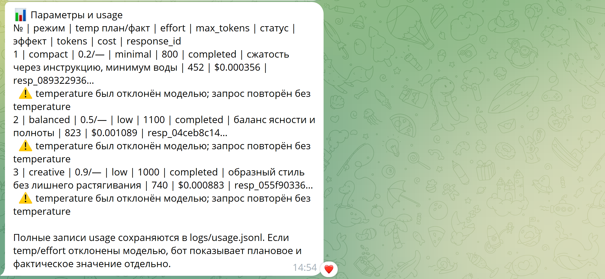

# Telegram Prompt Lab Bot

Telegram Prompt Lab Bot — компактный Telegram-бот на Python с использованием aiogram и OpenAI API.

Проект начался как простое учебное задание: создать Telegram-бота с памятью контекста пользователя и интеграцией с OpenAI. Я расширил базовые требования и добавил портфолио-фичу: режим `/compare`, который прогоняет один и тот же запрос пользователя через несколько стратегий генерации и сравнивает результат по стилю, расходу токенов, примерной стоимости и API-метаданным ответа.

В итоге бот становится не просто чат-интерфейсом, а небольшим Prompt Engineering Lab прямо внутри Telegram.

---

## Основная идея

Обычный учебный бот просто отправляет сообщение пользователя в LLM и возвращает ответ.

Этот проект делает больше:

* хранит отдельный контекст для каждого Telegram-пользователя;
* поддерживает обычный режим диалога;
* умеет очищать контекст пользователя;
* логирует параметры запросов и ошибки;
* отслеживает расход токенов и примерную стоимость;
* содержит команду `/compare` для тестирования разных режимов ответа;
* корректно обрабатывает ограничения модели и API.

Дополнительная фича `/compare` была добавлена осознанно, чтобы показать продуктовый, критический и инженерный подход: вместо слепой отправки запроса в модель бот помогает сравнить, как разные prompt-стратегии влияют на длину ответа, стиль, расход токенов и стоимость.

---

## Портфолио-фича: `/compare`

Главная портфолио-фича проекта:

```text
/compare <your prompt>
```

Пример:

```text
/compare Explain Docker Compose in simple words
```

Бот отправляет один и тот же запрос в трёх режимах:

| Mode     | Цель                                                 |
| -------- | ---------------------------------------------------- |
| Compact  | Короткий и прямой ответ                              |
| Balanced | Понятное структурированное объяснение                |
| Creative | Более живое объяснение с аналогией или мини-примером |

Для каждого режима бот показывает:

* запланированную temperature;
* фактическую temperature, если модель её приняла;
* reasoning effort;
* max output tokens;
* response status;
* token usage;
* примерную стоимость;
* OpenAI response ID.

Так простой Telegram-бот превращается в небольшой инструмент для тестирования LLM-ответов.

---

## Пример результата

```text
🧪 Prompt Lab: сравнение режимов

=== Compact ===
Docker Compose — это инструмент для запуска и управления несколькими Docker-контейнерами как единым приложением...

=== Balanced ===
Коротко — Docker Compose это инструмент, который позволяет описать и запустить несколько контейнеров Docker как одно приложение...

=== Creative ===
Docker Compose — это как дирижёр для группы контейнеров...

📊 Параметры и usage
№ | режим | temp план/факт | effort | max_tokens | статус | эффект | tokens | cost | response_id
1 | compact  | 0.2/— | minimal | 800  | completed | сжатость через инструкцию | 274 | $0.000312 | resp_...
2 | balanced | 0.5/— | low     | 1100 | completed | баланс ясности и полноты | 509 | $0.000782 | resp_...
3 | creative | 0.9/— | low     | 1000 | completed | образный стиль | 813 | $0.001376 | resp_...
```

---

## Почему это больше, чем обычный учебный бот

По заданию требовалось сделать Telegram-бота с интеграцией OpenAI API и хранением контекста в памяти.

Я добавил Prompt Lab-фичу, потому что реальные LLM-приложения требуют большего, чем просто отправить текст в API. В них важно:

* понимать, как параметры и prompt-стратегии влияют на результат;
* отслеживать usage и стоимость;
* обрабатывать ограничения API;
* проектировать полезные пользовательские режимы;
* вести логи для отладки и анализа;
* делать поведение системы понятным и проверяемым.

Во время тестирования выбранная модель отклонила ручную настройку `temperature`. Вместо того чтобы скрывать это поведение, бот обрабатывает ситуацию прозрачно: повторяет запрос без `temperature`, логирует событие и показывает запланированные и фактически применённые параметры.

Это отражает более реалистичный инженерный подход: наблюдать поведение API, учитывать edge cases и делать систему устойчивее.

---

## Возможности

* Telegram-бот на `aiogram`;
* интеграция с OpenAI API;
* отдельный контекст для каждого Telegram-пользователя;
* хранение контекста в памяти через `dict`;
* команда `/start`;
* команда `/help`;
* команда `/reset`;
* текстовая команда `очистить контекст`;
* обычный режим диалога;
* режим `/compare` с несколькими generation presets;
* команда `/stats` для локальной статистики usage;
* логирование параметров запросов;
* логирование ошибок;
* сохранение usage-записей в `logs/usage.jsonl`;
* примерная оценка стоимости;
* graceful fallback, если модель отклоняет параметры;
* диагностика incomplete responses.

---

## Tech stack

* Python 3.10+
* aiogram
* OpenAI Python SDK
* python-dotenv
* Telegram Bot API
* OpenAI Responses API

---

## Структура проекта

```text
prompt_lab_bot/
├── bot.py
├── config.py
├── context_manager.py
├── api_client.py
├── requirements.txt
├── .env.example
├── .gitignore
├── README.md
└── logs/
    └── .gitkeep
```

---

## Установка

Склонировать репозиторий:

```bash
git clone https://github.com/sualbo/telegram-prompt-lab-bot.git
cd telegram-prompt-lab-bot
```

Создать и активировать virtual environment:

```bash
python3 -m venv .venv
source .venv/bin/activate
```

Установить зависимости:

```bash
python -m pip install --upgrade pip
python -m pip install -r requirements.txt
```

Создать `.env` на основе примера:

```bash
cp .env.example .env
```

Заполнить ключи:

```env
BOT_TOKEN=your_telegram_bot_token
OPENAI_API_KEY=your_openai_api_key
OPENAI_MODEL=gpt-5-mini-2025-08-07
```

Запустить бота:

```bash
python bot.py
```

---

## Environment variables

Пример `.env`:

```env
BOT_TOKEN=your_telegram_bot_token
OPENAI_API_KEY=your_openai_api_key

OPENAI_MODEL=gpt-5-mini-2025-08-07

DEFAULT_MAX_OUTPUT_TOKENS=1200
TELEGRAM_CHUNK_SIZE=3900

INPUT_TOKEN_PRICE_PER_1M=1.25
OUTPUT_TOKEN_PRICE_PER_1M=10.00
```

Реальный файл `.env` нельзя коммитить в репозиторий.

---

## Команды бота

| Command             | Описание                             |
| ------------------- | ------------------------------------ |
| `/start`            | Стартовое сообщение                  |
| `/help`             | Справка                              |
| `/reset`            | Очистить контекст пользователя       |
| `/stats`            | Показать локальную статистику usage  |
| `/compare <prompt>` | Сравнить несколько режимов генерации |

Пользователь также может написать:

```text
очистить контекст
```

чтобы сбросить контекст диалога.

---

## Таблица usage для отчёта

Эта таблица полезна для учебного отчёта.

| Model                 | Temperature plan / actual | Reasoning effort | Max output tokens | Run | Effect                                              | Input tokens | Output tokens | Total tokens | Approx. cost | Status    | Response ID |
| --------------------- | ------------------------: | ---------------: | ----------------: | --: | --------------------------------------------------- | -----------: | ------------: | -----------: | -----------: | --------- | ----------- |
| gpt-5-mini-2025-08-07 |                   0.2 / — |          minimal |               800 |   1 | Compact answer, 4-5 предложений                     |      replace |       replace |      replace |      replace | completed | replace     |
| gpt-5-mini-2025-08-07 |                   0.5 / — |              low |              1100 |   2 | Balanced structured answer                          |      replace |       replace |      replace |      replace | completed | replace     |
| gpt-5-mini-2025-08-07 |                   0.9 / — |              low |              1000 |   3 | Creative answer с одной аналогией или мини-примером |      replace |       replace |      replace |      replace | completed | replace     |

Реальные usage-записи сохраняются локально в:

```text
logs/usage.jsonl
```

---

## Логирование

Проект логирует:

* запуск бота;
* пользовательские запросы;
* выбранную модель;
* запланированные generation parameters;
* фактически принятые параметры;
* OpenAI response ID;
* token usage;
* примерную стоимость;
* API errors;
* fallback events.

Локальные логи не предназначены для публикации в GitHub.

---

## Заметки о параметрах модели

Некоторые современные OpenAI-модели могут отклонять ручную настройку `temperature`.

Бот обрабатывает этот случай корректно:

1. Сначала отправляет запрос с запланированной `temperature`.
2. Если модель отклоняет `temperature`, бот повторяет запрос без неё.
3. В результате показывает запланированное и фактическое значение.
4. Событие сохраняется в логах.

Это поведение сделано намеренно и демонстрирует production-style error handling.

---

## Screenshots

Перед публикацией репозитория добавьте сюда скриншоты.

Пример:

```markdown


```

Рекомендуемые скриншоты:

* `/start`;
* обычный диалог;
* `/compare`;
* `/stats`.

Если скриншоты собраны в один PDF-файл, можно добавить ссылку так:

```markdown
Full screenshot report: [bot-demo-screenshots.pdf](assets/bot-demo-screenshots.pdf)
```

---

## Чеклист учебного задания

* [x] Telegram-бот на aiogram
* [x] Интеграция с OpenAI API
* [x] Отдельный контекст для каждого пользователя
* [x] Хранение контекста в памяти
* [x] Обновление контекста после каждого ответа
* [x] Команда `/reset`
* [x] Текстовая команда для очистки контекста
* [x] `.env` для ключей
* [x] Логирование ошибок
* [x] Логирование параметров запросов
* [x] Отслеживание usage и примерной стоимости
* [x] README-таблица для отчёта
* [x] Добавлена портфолио-фича: `/compare`

---

## Возможные улучшения

* SQLite для постоянного хранения контекста;
* экспорт usage-статистики в CSV;
* admin-only usage dashboard;
* inline Telegram buttons для выбора режима;
* Dockerfile и Docker Compose deployment;
* простой web dashboard для результатов Prompt Lab.

---

## License

MIT License.

